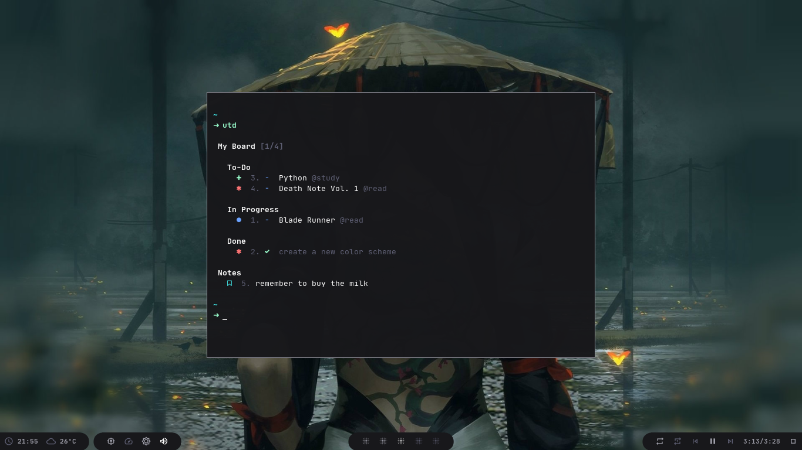

# Ugly To-Do

My personal To-Do app. I made this based on Taskbook, one app that I really like, you'll find the link below.

## Getting Started

### Prerequisites

You need to install Python3 and [NerdFonts](https://www.nerdfonts.com/font-downloads):

The font I'm using is **JetBrainsMono**

To install this font, copy/move to the folder _~/.fonts_ and run in the terminal:

```bash
$HOME
-> fc-cache -fv
```

### Cloning

First you need to clone the repo:

```bash
$HOME
-> git clone https://github.com/Murzchnvok/ugly-todo
```

Create **bin** folder in the **$HOME** directory (if it doesn't exist):

```bash
$HOME
-> mkdir $HOME/bin/
```

_Add the **bin** folder to the **$PATH** variable!_

Now create a symlink to the **utd.py** script:

```bash
$HOME/Projects
-> ln -s $HOME/ugly-todo/utd.py $HOME/bin/utd
```

### Running

Open a new terminal and run (you'll find help in there):

```bash
$HOME
-> utd -h
```

Remember to keep updated:

```bash
$HOME
-> cd $HOME/utd && git pull
```

## You might be interested

- [Taskbook (task and notes command line)](https://github.com/klaussinani/taskbook)


