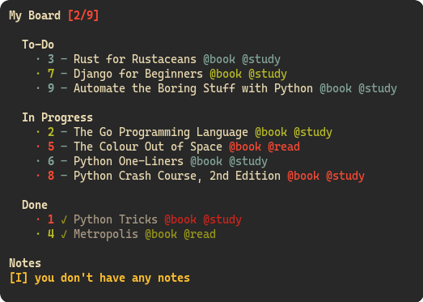

# Ugly To-Do

My personal To-Do app. I made this based on Taskbook, one app that I really like, you'll find the link below. Nice that some people are using this app, prolly not much update for now on since it's doing what I had in mind, but maybe I'll make a GUI option soon.

## Getting Started

### Prerequisites

**_Every test and instalation process was done on Linux_**. You need to install Python3.10+ and [NerdFonts](https://www.nerdfonts.com/font-downloads):

The font I'm using is **JetBrainsMono**

To install this font on, copy/move to the folder _~/.fonts_ and run in the terminal:

```bash
$HOME
-> fc-cache -fv
```

### Cloning

First you need to clone the repo:

```bash
$HOME
-> git clone https://github.com/Murzchnvok/ugly-todo
```

Create **bin** folder in the **$HOME** directory (if it doesn't exist):

```bash
$HOME
-> mkdir $HOME/bin/
```

_Add the **bin** folder to the **$PATH** variable!_

Now create a symlink to the **main.py** script:

```bash
$HOME
-> ln -s $HOME/ugly-todo/src/main.py $HOME/bin/utd
```

### Running

First run this in the **ugly-todo** folder:

```bash
$HOME/ugly-todo
-> pip3 install -r requirements.txt
```

Open a new terminal and run (you'll find help in there):

```bash
$HOME
-> utd -h
```

Remember to keep updated:

```bash
$HOME
-> cd $HOME/ugly-todo && git pull
```

## You might be interested

- [Taskbook (task and notes command line)](https://github.com/klaussinani/taskbook)


